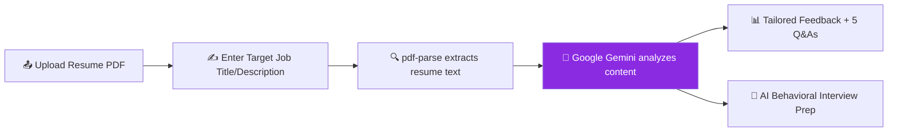

<div align="center">


<p>
  
</p>

<p>
  <a href="https://airesume-1-ycaj.onrender.com">
    
  </a>
</p>

<p>
  
  
  
  
  
  
  
</p>

</div>

<br/>

## 🌟 Overview

**AI Resume Analyzer** is a full-stack AI-powered platform that gives job seekers **instant, role-specific feedback** on their resumes. Upload your resume along with a target job title or description, and let **Google Gemini** analyze it — generating tailored improvement suggestions and simulating a real **behavioral interview**.

No more guessing whether your resume is good enough. Just upload, analyze, and improve.

<br/>

## ✨ Key Features

<table>
<tr>
<td width="50%">

### 📄 Smart Resume Analysis
Upload a resume + target role and get an AI-driven breakdown of strengths, gaps, and improvement areas — tailored to the specific job.

</td>
<td width="50%">

### 🎯 Role-Specific Q&A
Automatically generates **5 tailored questions & answers** to help you strengthen your resume for the exact role you're targeting.

</td>
</tr>
<tr>
<td width="50%">

### 🎤 AI Interview Prep
Get **AI-generated behavioral interview questions** based on your resume and job description — practice before the real thing.

</td>
<td width="50%">

### 🔐 Secure Authentication
Full **JWT-based auth flow** keeps your data and resume history private and secure.

</td>
</tr>
</table>

<br/>

## 🛠️ Tech Stack

<div align="center">

| Layer | Technologies |
|---|---|
| **Frontend** | React.js, Redux Toolkit |
| **Backend** | Node.js, Express.js, Nodemon |
| **Database** | MongoDB |
| **AI Engine** | Google Gemini API |
| **Auth** | JWT (JSON Web Tokens) |
| **File Handling** | Multer + pdf-parse (resume PDF parsing) |
| **Deployment** | Render |

</div>

<br/>

## ⚙️ How It Works



<br/>

## 🚀 Getting Started

### Prerequisites
- Node.js installed
- MongoDB instance (local or Atlas)
- Google Gemini API key

### Installation

```bash
# Clone the repository
git clone https://github.com/mk6084518-design/ai-resume-analyzer.git
cd ai-resume-analyzer

# Install backend dependencies
cd backend
npm install

# Install frontend dependencies
cd ../frontend
npm install
```

### Environment Variables

Create a `.env` file in the backend directory:

```env
PORT=3000
MONGO_URI=your_mongodb_connection_string
GEMINI_API_KEY=your_gemini_api_key
JWT_SECRET=your_jwt_secret
```

### Run Locally

```bash
# Start backend (runs on port 3000)
cd backend
nodemon index.js

# Start frontend
cd frontend
npm run dev
```

<br/>

## 🔗 Live Demo

<div align="center">

### 👉 [**airesume-1-ycaj.onrender.com**](https://airesume-1-ycaj.onrender.com) 👈

</div>

<br/>

## 📌 Roadmap

- [ ] Resume scoring dashboard with visual analytics
- [ ] Support for multiple resume formats (DOCX, TXT)
- [ ] ATS-compatibility checker
- [ ] Downloadable AI-optimized resume suggestions

<br/>

## 🤝 Contributing

Contributions, issues and feature requests are welcome!
Feel free to check the [issues page](../../issues).

<br/>

## 👤 Author

<div align="center">

**Manoj Kumar**

<a href="https://github.com/mk6084518-design">
  
</a>

</div>

<br/>


</div>
